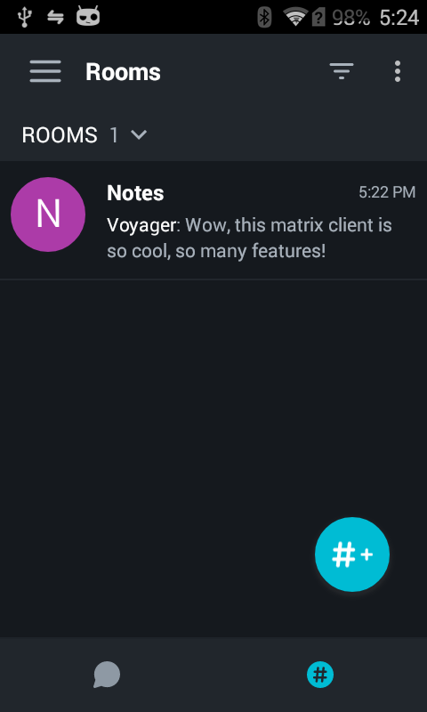
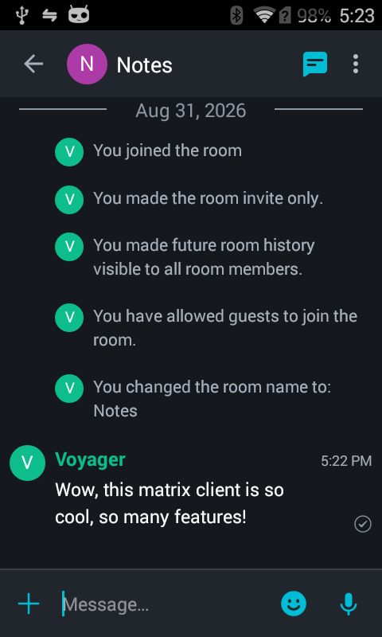
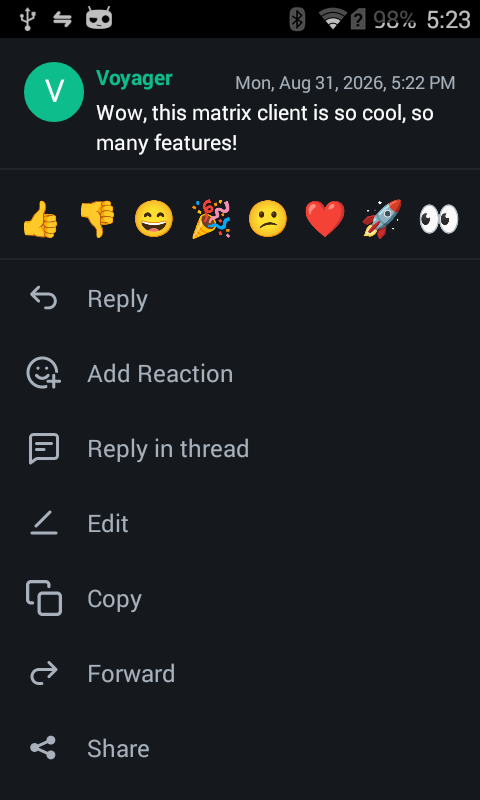
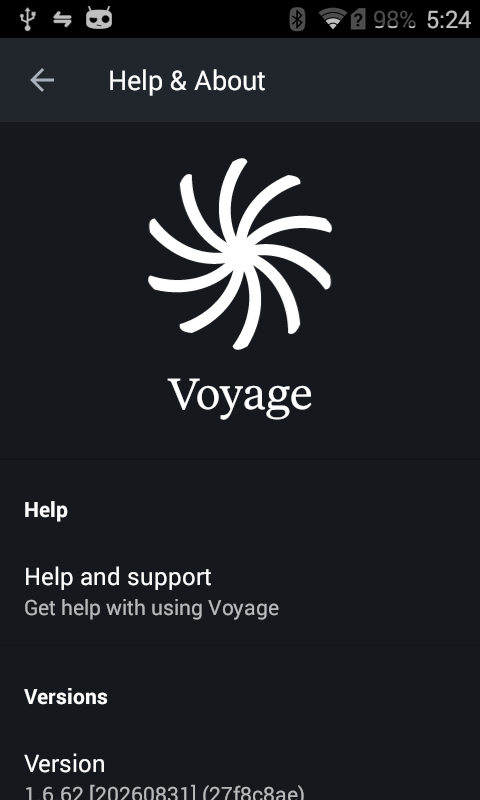

#  Voyage

[](https://matrix.to/#/#voyage:matrix.org)
[](#donations)

Voyage is a [Matrix](https://matrix.org/) client for Android, based on [Element Classic](https://github.com/element-hq/element-android). The app can be run on every Android device with Android 4.0 Ice Cream Sandwich and later (API 14).

<p align="center">
  
  
</p>
<p align="center">
  
  
</p>

# What's different

[CHANGES.md](CHANGES.md) lists the features, improvements and removals this fork
adds on top of Element Classic.

# Installing

Grab a nightly APK from the [releases](../../releases) tab.

Alternatively, build and install it yourself:

Debug: `./gradlew installDebug`

Release: `./gradlew install`

# Running on Android 4.0–4.3 (Ice Cream Sandwich / Jelly Bean)

On Android 4.0–4.3 (API 14–18) the app currently requires the device's Dalvik
bytecode verifier to be disabled, or it crashes when opening a room.

Disabling verification requires **root**. Voyage automatically prompts for and
applies this on first launch. Therefore, you must be rooted to use Voyage on
Android 4.0-4.3.

To re-enable verification, delete the file (if it holds nothing but this line)
and reboot:

```
adb shell su
rm /data/local.prop
reboot
```

# Donations

Monero:

```
85Em2xoemw7AvSrQL417MtLc1ytfT3TzBUiZU67q4tKTKNpwx6TQjKqasrTk1FUvnNdenESV6d4k8fFuoXbLowXT32AtCbb
```
